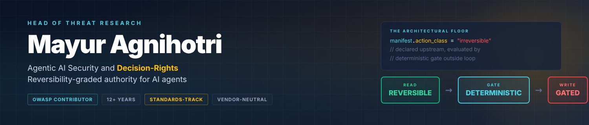

<div align="center">



[](https://github.com/OWASP/AISVS)
[](https://github.com/Mayur021/writings)
[](https://creativecommons.org/licenses/by/4.0/)
[]()
[]()

**Head of Threat Research** · Agentic AI Security & Decision-Rights · AI SOC + OT/ICS · SecOps · Board Member

</div>

---

## 🎯 Focus

Working on the architectural floor for AI agents that take irreversible actions. The thesis in one line: **investigation is reversible, actuation is not — and the gate for the write side has to be code the agent cannot reach, evaluating a manifest the agent cannot rewrite.**

Three primitives carry the architecture:

```
manifest.action_class    = "irreversible"   // declared upstream by publisher
deterministic.gate       = outside_loop      // code the agent cannot reach
worst_case.chain_rule    = governs_chain     // composed actions inherit the worst class
```

Twelve-plus years across threat research, AI-driven SOC detection and response, OT/ICS security, cyber-range exercise design, cyber-crime investigation, and web/mobile/application security.

---

## 🛡 Standards-Track Contributions

| Project | Status | Scope |
|---|---|---|
| **OWASP AISVS** |  | C9.2.6 (manifest-declared action class) + C9.2.7 (worst-case chain rule) merged into C09 research chapter, proposed for v1.01 |
| **OWASP SPVS** |  | V5.6.5 IR decision-rights ([PR #14](https://github.com/OWASP/www-project-spvs/pull/14)), V1.3.7 NHI runtime decision-rights ([PR #15](https://github.com/OWASP/www-project-spvs/pull/15)), supply-chain ([Issue #13](https://github.com/OWASP/www-project-spvs/issues/13)) |
| **OWASP Cornucopia (Agentic AI)** |  | Action-authority taxonomy ([Issue #3018](https://github.com/OWASP/www-project-cornucopia/issues/3018)) |
| **OWASP GenAI Security Project** |  | Reversibility-graded authority into Agentic AI Threats & Mitigations v1.1 ([Issue #13](https://github.com/GenAI-Security-Project/GenAI-Agent-Security-Initiative/issues/13)) |
| **CSA NHI v1.0** |  | Peer review June 2026 |

**Prior OWASP leadership**: AppSec India Co-Leader (2016–2020) · OWASP Indore Chapter Leader (2017–2018)

---

## ⚙️ Reference Implementations

<table>
<tr>
<td width="50%" valign="top">

### 🔒 [aisvs-action-class-reference](https://github.com/Mayur021/aisvs-action-class-reference)


Reference implementation of **OWASP AISVS C9.2.6 + C9.2.7**: manifest-declared action class, deterministic gate, worst-case chain rule. JSON schema + Python.

</td>
<td width="50%" valign="top">

### 🆔 [nhi-runtime-decision-rights](https://github.com/Mayur021/nhi-runtime-decision-rights)


NHI runtime decision-rights companion to **OWASP SPVS V1.3.7**. Identity provenance verification, token freshness, action-class authorization.

</td>
</tr>
</table>

---

## 📜 Writings

[](https://github.com/Mayur021/writings)

Long-form essays on AI agent security, decision-rights, reversibility-graded authority, and contribution methodology. Three essays published June 2026 (~9,900 words + 7 figures):

- **[The Decision-Rights Plane: An Architectural Gap in AI Security](https://github.com/Mayur021/writings/tree/main/2026-06-02-decision-rights-plane)** — the missing primitive at layers 4 and 5
- **[Investigation Is Reversible. Actuation Is Not.](https://github.com/Mayur021/writings/tree/main/2026-06-02-investigation-vs-actuation)** — the read/write architectural fold as design primitive
- **[What I Learned Contributing Across Five Standards Surfaces](https://github.com/Mayur021/writings/tree/main/2026-06-02-contributing-across-standards-surfaces)** — the cross-surface contributor method

### Magazine Publications

- *Interview with Mayur Agnihotri* — Science Of Cyber Security (Oct 2017)
- *Conviction Of Digital Crime* — National Cyber Defence eMagazine (Aug 2016)
- *PenTest: Penetration Testing in Linux* — PenTest Magazine (Mar 2016)
- *PowerShell For Penetration Testing* — PenTest Magazine (Jan 2016)
- *Predictions For Cyber Security in 2016* — eForensics and Hakin9 (Dec 2015)

---

## 🏆 Responsible Disclosure Recognition


LDAP server flaw research (Red Hat) and web-application vulnerability disclosures across major brands.

---

## 🌐 Current Roles

| Role | Org | Since |
|---|---|---|
| Information Security Specialist | **StraightArc Technologies** | 2020 |
| Board Member | **SkyVirt** | 2017 |
| Senior Subject Matter Expert | **TCS iON** | 2022 |
| Board of Studies | **Ramachandra College of Engineering** | 2023 |
| CHFI Item Writer | **EC-Council** | 2016 |
| Technical Committee | **Digital 4n6 Journal** | 2016 |
| Team Member | **National Cyber Defence Research Centre** | 2016 |
| Director | **ARNE Solutions** | 2016 |

---

## 🤝 Connect

[](https://www.linkedin.com/in/mayuragnihotri/)
[](https://x.com/I_AM_Mayur0021)
[](https://straightarc.com)

📍 Udaipur, India · ⏱ GMT+05:30

---

<div align="center">

*Vendor-neutral standards work. Decision-rights for AI agents, reversibility as the architectural floor, manifest-declared action class as the standards-side answer.*

</div>
